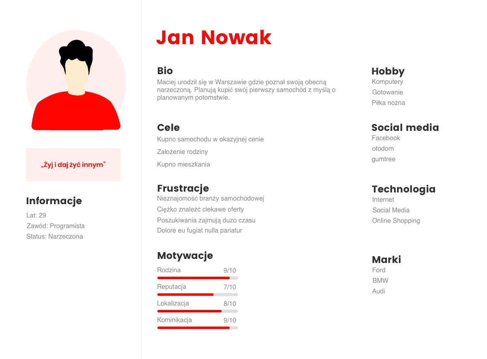

Co znajduje się w tej sekcji?

    Badanie konkurencji i rynku (ocena rozwiązań i modeli biznesowych).
    Wymagania biznesowe.
    Cele platformy.
    Określenie person i podstawowych elementów brandingu.

Nie istniejemy w próżni – projektowanie czegokolwiek w dobie kapitalizmu bez uprzedniego zbadania rynku i konkurencji, porównania dostępnych już rozwiązań oraz wyciągnięcia wniosków z błędów i sukcesów najlepszych w branży (lub w podobnych branżach – jeżeli znaleźliśmy całkowicie nową niszę) zwyczajnie mija się z celem. Dlaczego?

Odpowiedź jest niezwykle prosta: ponieważ może się okazać, że nasza wymarzona usługa lub produkt już istnieją. W takim wypadku, bez zaoferowania czegoś “ekstra” klientowi, ciężko oczekiwać, że zmieni on dotychczasowego dostawcę. 

Nie bez znaczenia są też wnioski, jakie można wyciągnąć z badania konkurencji – ostatecznie fraza “uczyć się na błędach” nie wzięła się znikąd. A jak wiadomo, lepiej uczyć się na cudzych błędach, niż powielać je samemu (nie tylko w kontekście biznesowym).

Równie ważne jest badanie grupy odbiorców i ich potrzeb – w końcu to oni mają być klientem docelowym. Często jednak etap ten jest pomijany, a wnioski wysnuwane są na podstawie własnych przekonań, zamiast rzetelnych danych. 

Rezultat? W zależności od branży, w pierwszej fazie wdrażania upada nawet 50-80% startupów. GUS także nie podnosi na duchu liczbami: z badań wynika, że w pierwszym roku od założenia upada ponad 30% nowo powstałych biznesów; kolejne 20% wytrzymuje na rynku tylko o rok dłużej.

Jeżeli jednak poprawnie przeprowadzimy wspomniane badania, stworzenie najważniejszych person oraz podstaw brandingu będzie znacznie łatwiejsze i obarczone o wiele mniejszym marginesem niedostosowania do potrzeb rynku.

Badania są pierwszym krokiem do określenia wymagań biznesowych i celów platformy/aplikacji – właśnie ten etap odróżnia proces ideacji (“wymyślania” nowego produktu/usługi), od pierwszego etapu wdrażania. Bez jasno rozpisanego planu biznesowego i realnych celów nawet najlepszy pomysł nie otrzyma dofinansowania na rozwój, a jak już kiedyś pisaliśmy: startup – na podobieństwo rośliny bez wody – “uschnie” bez wkładu pieniężnego.

    Wyznaczenie celu to kluczowa część procesu analizy i planowania przy tworzeniu strony internetowej. Rzutuje ona na każdy aspekt tworzenia (UXy, grafika, kod). Zanim zaczniemy myśleć o kolorach, schematach czy treści, musimy znać cel, do którego zmierzamy. Musimy również dokładnie poznać grupę docelową, dowiedzieć się, jakie są jej problemy, czego potrzebuje, jak tworzyć treści, które ją zainteresują.”

Więcej o tym w jaki sposób tworzyć cele dla strony internetowej (oraz aplikacji i platformy) możecie przeczytać we wpisie “Cele strony internetowej – jak je ustalać i mierzyć, aby Twoja strona odniosła sukces.”