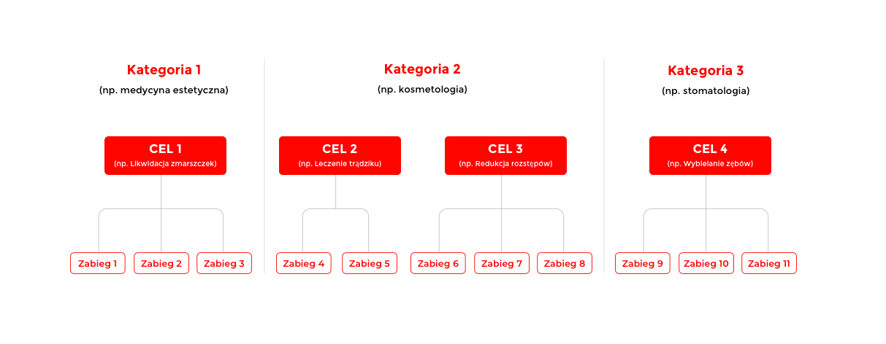
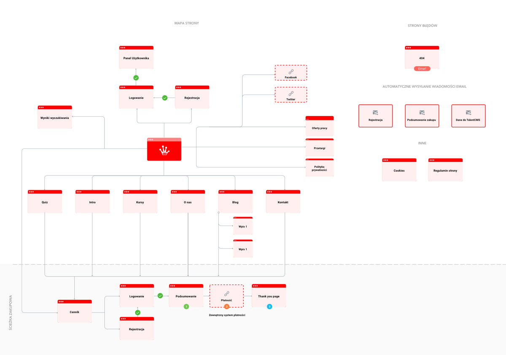
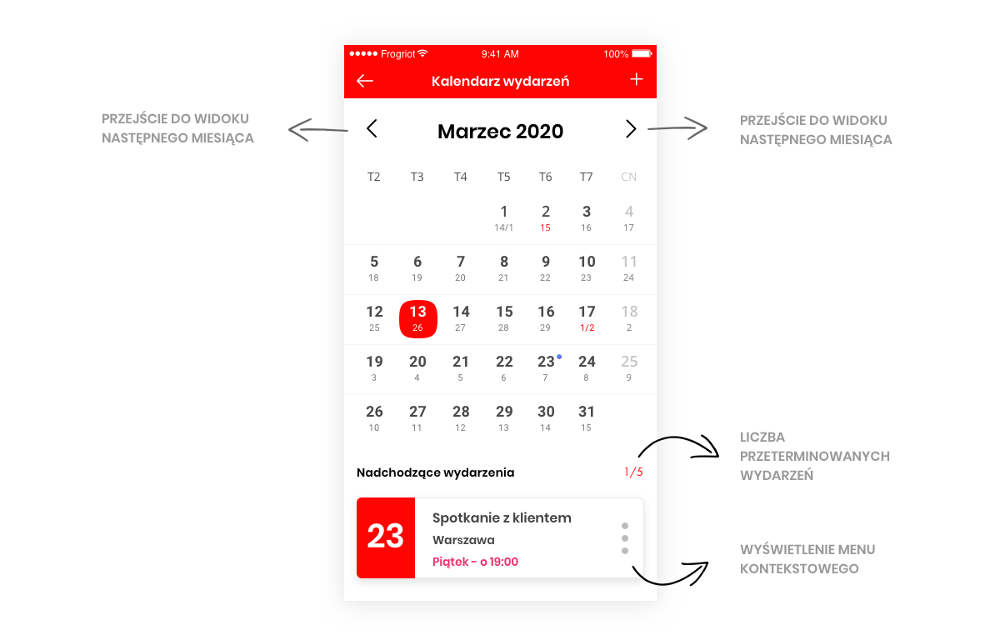

Co znajduje się w tej sekcji?

    Architektura strony/aplikacji.
    Mapa strony/aplikacji oraz ścieżki zakupowe/User Journey.
    Lista szablonów strony/aplikacji oraz tabelaryczna lista z ogólnym opisem poszczególnych szablonów.
    Opis zawartości kluczowych szablonów i modułów.
    Opis funkcjonalności na poszczególnych ekranach.
    Lista modułów do przygotowania i implementacji.
    Lista niezbędnych funkcjonalności.
    Tworzenie contentu – kto jest odpowiedzialny za tworzenie, wprowadzanie i zarządzanie contentem.
    Wersje językowe.
    Lista zewnętrznych integracji (CRM, emailing, Video hosting, Chat i inne).

Najważniejsza część dokumentacji projektowej. Można by rzec – jej wnętrzności. Porządne opisanie elementów, które powinny się w niej znaleźć mogłoby posłużyć jako osobny wpis, postaramy się więc jak najlepiej podsumować jej główne cele 🙂

Podobnie jak wspomniany wcześniej wymarzony dom, tak i aplikacja/platforma potrzebuje własnego planu architektonicznego. Jedyna różnica jest taka, że zamiast opisu co jest fundamentem, a co ścianą, otrzymujemy opis tego z jakich elementów będzie się składał produkt końcowy i w jaki sposób te elementy będą spełniały wyznaczone wcześniej cele biznesowe.

Kolejnym punktem na liście jest mapa oraz ścieżki zakupowe/User Journey. 

Mapa zazwyczaj przypomina drzewo decyzyjne i jasno pokazuje wszystkie możliwe ścieżki i połączenia między poszczególnymi widokami; zaplanowanie tego na początku (przed wdrożeniem) oznacza mniejszą ilość poprawek na końcu (a tym samym mniejsze koszty aplikacji).

Ścieżki zakupowe i/lub User Journey sugerujemy zawsze opisywać na konkretnych przykładach z wykorzystaniem ustalonych wcześniej person. Zazwyczaj takich ścieżek tworzy się kilka, aby uwzględnić najważniejsze funkcje portalu/aplikacji i najbardziej prawdopodobne scenariusze interakcji. Sposób prezentacji takich danych może być różny: od diagramu, przez zwykły opis, po infografikę lub nawet komiks… wszystko po to, aby ostatecznie zarówno Klient, jak i wykonawca mieli takie samo wyobrażenie pożądanego efektu końcowego, ale także po to, aby upewnić się, że najważniejsze funkcjonalności i scenariusze zostały uwzględnione już na etapie planowania.

Następnie spisujemy listę koniecznych widoków, doprecyzowujemy szablony najważniejszych z nich oraz opisujemy ich zawartość. Pozostając przy porównaniu do budowy domu – jest to odpowiednik listy pokoi wraz z opisem przeznaczenia i zawartości każdego z nich; w tym elementów, które powinny pozostać spójne bez względu na pomieszczenie (jak np. kształt i kolor kontaktów oraz przełączników światła, które byłyby odpowiednikiem stopki lub górnej nawigacji platformy/aplikacji). Lista wymaganych widoków jest niezbędna do wdrożenia aplikacji/portalu – w innym wypadku wykonawca zwyczajnie nie wie ile/jakie widoki powinien zrealizować.

Na tym jednak nie poprzestajemy – przy analizie projektowej (tak samo jak przy projekcie budowy domu) panuje zasada: im więcej szczegółów i wskazówek odnośnie wymagań Klienta, tym lepiej. Dlatego też każdy widok powinien mieć dołączony opis funkcjonalności, które docelowo mają się na nim znaleźć. 

W tej sekcji warto sprecyzować także najważniejsze wymagania odnośnie contentu: kto będzie odpowiedzialny za jego tworzenie, wprowadzanie i zarządzanie nim? Jeżeli content będzie w całości lub chociaż częściowo user-generated, to w jaki sposób powinno się nim zarządzać, dając jednocześnie użytkownikom jak najwięcej swobody? Ile i jakie wersje językowe będą potrzebne? Jak mają być realizowane – czy poza językiem ma się np. zmieniać także waluta? Jak mają wyglądać adresy URL i domena dla różnych wersji językowych? Czy konieczne będzie tłumaczenie contentu po oficjalnym starcie platformy/aplikacji i jeżeli tak, to kto będzie za to odpowiadał?

Całość zamyka lista podsumowująca najważniejsze integracje zewnętrzne, takie jak CRM (Customer Relationship Management tool / narzędzie do zarządzania relacjami z Klientem), chat, newsletter, video hosting i inne, wraz z opisem ich przeznaczenia.