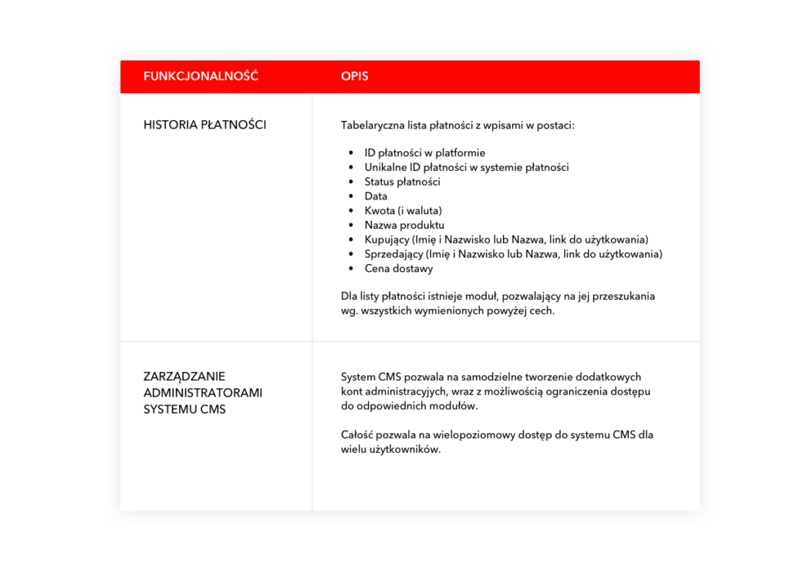

Co znajduje się w tej sekcji?

    Struktura adresów URL (określenie jakie mają być poszczególne linki przy różnych funkcjonalnościach).
    Przekierowania (czy trzeba robić przekierowania istniejących adresów URL).
    Określenie kluczowych breakpointów (na jakich rozmiarach ekranów aplikacja ma być sprawdzona oraz stworzenie tabelarycznej listy rozmiarów ekranów wraz z referencją do urządzenia).
    Wymagania dot. responsive design (RWD, Grid).
    Wsparcie przeglądarek (lista przeglądarek dla których strona ma wyświetlać się poprawnie).
    Opis modułu CMS i lista funkcjonalności.

Wymagania techniczne być może nie są najłatwiejszą decyzją (i lekturą) dla Klienta, ale z perspektywy samej platformy/aplikacji jest to część bardzo ważna. To właśnie tu znajdą się wytyczne odnośnie poprawnej budowy adresów URL wewnątrz platformy/aplikacji, zostaną doprecyzowane breakpointy (czyli inaczej: rozmiary ekranów, na jakich platforma/aplikacja ma być przetestowana przez wykonawcę), wspierane przeglądarki oraz inne wymagania odnośnie responsywności i inkluzywności (np. wersja kontrastowa dla niedowidzących). Te elementy często wpływają nie tylko na finalny dobór narzędzi, ale także na wybór języka całej aplikacji/platformy! O wiele rozsądniejsze, szybsze i tańsze jest ustalenie tych szczegółów na początku pracy projektowej, niż wprowadzanie zmian i łatanie kiepskich wyborów podczas lub nawet na koniec developmentu.

Dodatkowo, w tej sekcji powinien znaleźć się także opis modułu CMS (Content Management System – czyli inaczej: system zarządzania treścią) oraz lista jego funkcjonalności; przykładowo: które elementy gotowej platformy/aplikacji powinny być zawsze edytowalne z poziomu CMS, a które mogą być “zakodowane na twardo” (tj. będą wymagały bezpośrednich zmian w kodzie).

