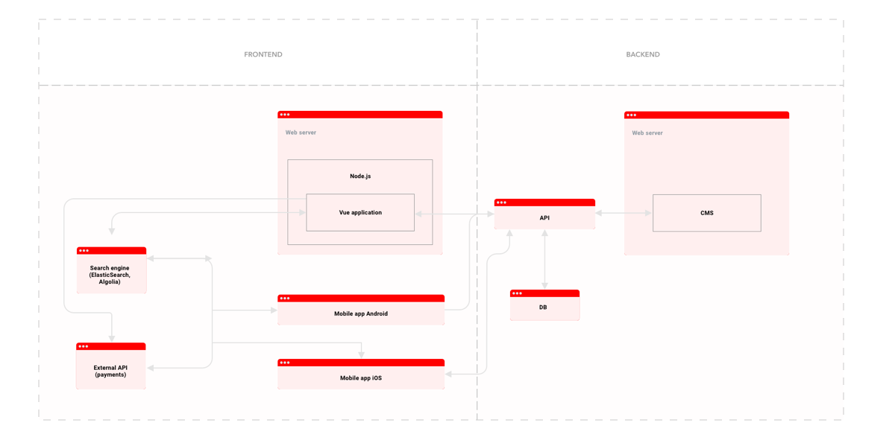

Co znajduje się w tej sekcji?

    Wybór platformy technologicznej.
    Opis środowiska produkcyjnego i testowego oraz repozytorium.
    Transfer usług (jeżeli dotyczy).
    Wymagania techniczne dotyczące serwera.

Sekcja architektury technologicznej ma za zadanie jak najlepsze rozplanowanie technicznej realizacji projektu – od jego bezpieczeństwa, przez sposób wdrożenia kluczowych funkcjonalności, utrzymanie i rozwój aplikacji/platformy, ale też dobranie najlepszych narzędzi do osiągnięcia opisanych w poprzednich rozdziałach celów.

Wybór platformy musi uwzględniać ruch opisany w sekcji 5 (Wymagania dot. ruchu), a jednocześnie zapewnić aplikacji/platformie jak największe bezpieczeństwo i łatwość developmentu. Ważnym elementem jest tutaj także dług technologiczny. Czym on jest?

Przez dług technologiczny rozumiemy ograniczenia, jakie narzucają nam konkretne rozwiązania programistyczne. To właśnie podczas tworzenia dokumentacji projektowej powinniśmy znaleźć odpowiedzi na pytania: czy wybrana przez nas technologia jest rozwijana i będzie rozwijana w przyszłości? Czy są jakiekolwiek przesłanki świadczące o tym, że technologia ta ulegnie poważnym zmianom w niedługim czasie? A może już teraz widać, że technologia “umiera” i nie posiada aktywnego drona developerów, którzy ją rozwijają?

Dług technologiczny powstaje zawsze – ponieważ każda technologia ewoluuje – można go jednak niepotrzebnie powiększyć już na starcie decydując się na wykonanie aplikacji/platformy “na wczoraj” i najlepiej po kosztach. 

Przykład:

Firma X tworzy platformę w 2011 roku, korzystając z konkretnego środowiska (np. CodeIgniter, wersja 2.1.0). Decyduje się na sieciowy framework (np. Gearman) do realizacji zadań (m.in. wykonywania połączeń i wysyłania powiadomień, ale także np. do rejestracji nowych użytkowników) oraz inne integracje zewnętrzne.

Kilka lat później na rynku pojawiają się nowe wersje zarówno wykorzystanego środowiska jak i frameworka; firma jednak nie podejmuje się aktualizacji ze względu na koszta i obawę o problemy mogące wystąpić w trakcie zmian. Kolejne wersje obu narzędzi także są pomijane.

W 2017 roku framework sieciowy kończy oficjalne wsparcie dla swojego produktu, pozostawiając go tym samym z ogromnymi dziurami w bezpieczeństwie (stale rosnącymi) i coraz większym niedostosowaniem do nowszych narzędzi. W rezultacie znacznie wzrastają koszta utrzymania bieżących rozwiązań firmy X – każdy nowy problem trzeba rozwiązywać własnymi zasobami, a developerów mających chęci i doświadczenie w pracy z martwym produktem jest coraz mniej.

Jednocześnie, brak aktualizacji wybranego środowiska powiększa przepaść między platformą, a integracjami zewnętrznymi (które podlegają automatycznym aktualizacjom, niezależnym od firmy X). Z każdym dniem dług technologiczny rośnie, a przy każdej takiej aktualizacji pojawia się coraz więcej problemów z integracjami. 

Efekt? Ze względu na przestarzałą architekturę platforma jest niezabezpieczona, nie spełnia wymogów GDPR, a jej podstawowe funkcjonalności przestają działać. Firma X nie może znaleźć developera, który zgodziłby się pracować w starym środowisku i na skutek tego zaczyna uginać się pod ciężarem długu technologicznego. W rezultacie traci kolejne okazje biznesowe i ostatecznie jest zmuszona przepisać całą platformę od nowa (czyt. ponieść koszta rozległych prac projektowych i developerskich).

Repozytorium oraz środowisko testowe i produkcyjne odpowiadają z kolei za to jak będzie wyglądał bieżący rozwój produktu (w jaki sposób developerzy mogę edytować/dodawać kod, jak dostarczane będą kolejne wersje na deploy). Warto już w tym momencie zdecydować się na jedną z opcji dodawania zmian: continuous integration lub dodawanie zmian manualnie, przy pomocy dodatkowych zasobów (np. admina).

Transfer usług (jeżeli dotyczy, tj. jest to nowa wersja istniejącego już produktu) może wiązać się z dodatkowymi kosztami (ze względu na niekompatybilność usług); dlatego warto sprawdzić to już na etapie projektowania i uwzględnić w kosztach developmentu.

Wymagania techniczne serwera mają za zadanie upewnienie się, że serwer (usługa) spełnia wymogi wybranego softu (np. potrzebujemy bazy danych X – czy dostawca świadczy taką usługę?).